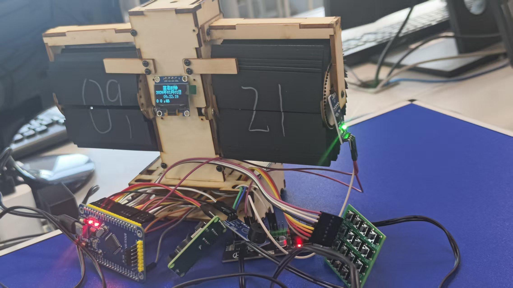

# 机械翻页时钟 | Mechanical Flip Clock

基于 STC89C52 单片机、DS1302 实时时钟与双步进电机驱动的机械翻页时钟实物。
分钟与时钟叶片独立翻转显示时间，集成 OLED 屏、矩阵键盘、闹钟功能与霍尔传感器零点校正。

## 硬件架构

- 主控：STC89C52（11.0592MHz）
- 时钟芯片：DS1302（三线SPI，掉电保护）
- 显示：I²C OLED 128×64（状态辅助显示）+ 机械翻页叶片（核心显示）
- 按键：4×4 矩阵键盘
- 驱动：双路 28BYJ-48 步进电机，8拍半步模式
- 传感器：分钟盘霍尔 ×1 + 时钟盘霍尔 ×1
- 蜂鸣器：无源蜂鸣器（闹钟旋律合成）

## 核心特性

- **步数补偿算法**：解决减速步进电机非整除传动比导致的走时漂移
- **霍尔传感器零点闭环校正**：分/时归零时刻低速寻零，消除长期累积误差
- **单定时器多任务调度**：1ms中断驱动电机步进/闹钟旋律/OLED闪烁并行执行
- **整点分时驱动**：优先分钟翻页，规避双电机同步启动致电压跌落
- **完整交互系统**：时钟设置、闹钟设置、电机手动调校三模式切换
- **闹钟功能**：独立设置界面，双音调旋律响铃，支持一键停止

## 引脚定义

| 功能 | 引脚 |
|------|------|
| DS1302 RST | P3.5 |
| DS1302 SCLK | P3.7 |
| DS1302 DSIO | P3.6 |
| OLED SCL | P1.0 |
| OLED SDA | P1.1 |
| 电机驱动 | P2（低4位分钟/高4位时钟） |
| 键盘行 | P1.7 - P1.4 |
| 键盘列 | P3.3 - P3.0 |
| 蜂鸣器 | P3.4 |
| 分钟霍尔 | P1.2 |
| 时钟霍尔 | P1.3 |

## 步数补偿原理
28BYJ-48 步进电机经减速比后，驱动分钟盘翻一页（6°）理论需 68.27 步，
但电机只能执行整数步，每走 68 步产生约 0.27 步转角欠量。
补偿策略：
1. 基准驱动：每分钟 68 步
2. 周期补偿：每 3 分钟累积欠量达阈值，多补 5 步
3. 特殊点补偿：第 20 分钟叶片卡涩点额外注入 120 步
## 零点校正流程
归零时刻 → 触发低速寻零 → 电机步进（每步20ms）→ 检测霍尔信号
↓ 未检测到 ↓ 检测到
继续步进 立即停止 + 位置计数器清零 + 校正完成
## 环境
- Keil C51
- STC-ISP 烧录工具
- 晶振 11.0592MHz

## 使用说明

| 按键 | 功能 |
|------|------|
| 按键1 | 进入/退出设置模式 |
| 按键2 | 切换设置项 |
| 按键3 | 数值+1 |
| 按键4 | 数值-1 |
| 按键5 | 保存设置 |
| 按键6-9 | 电机手动调校（按住连转） |
| 按键10 | 闹钟设置 |
| 按键13 | 闹钟开关/停止响铃 |

## 实物展示

图片拍的比较少，由于本课程设计最后评为优秀，被老师收回，故图片并非最终效果

## 协议

MIT License
